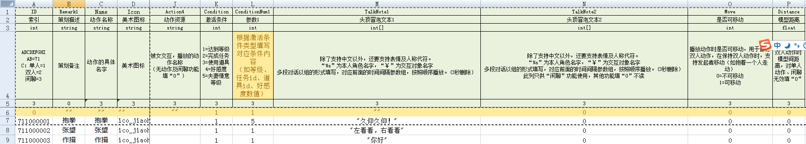
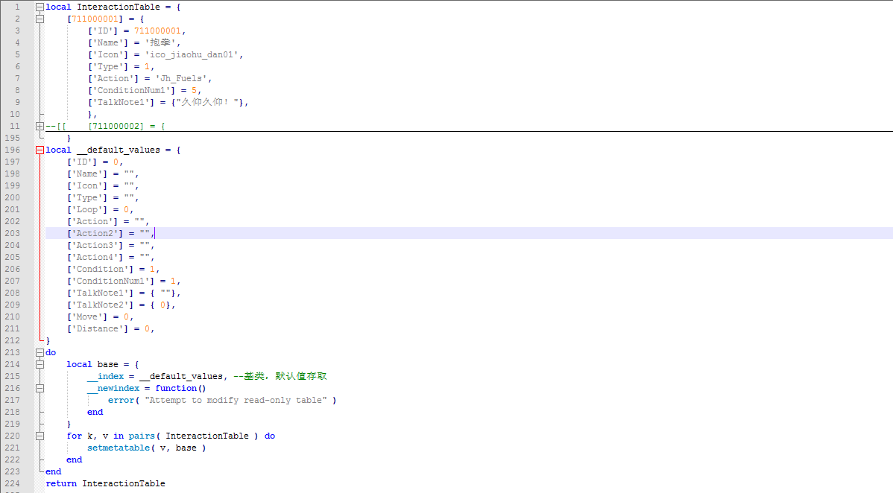
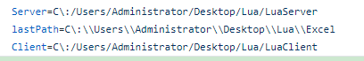

##前言
    工作需要用到lua表，基于java实现
###
* 1
    表格结构
    
    第一行：字段名 
    第二行：策划描述
    第三行：数据类型（后面有对应）
    第四行：类型含义（策划用）
    第五行：导表控制行 
    第六行：数据默认行（后面会有这行的用法）
    导出的表名和文件名是sheet名（支持多个sheet） 
* 2
    导出lua中的结构(优化过的) 
    [InteractionTable.lua](https://github.com/SiMaLaoShi/ExcelTool/blob/master/InteractionTable.lua)
    
    
         
* 3 
    使用方法
    ~~(如果是第一次使用)直接使用jar包运行即可，使用完成后有一个同级目录~~
    * 1 工作目录配置
    在jar包的同级木新建一个config.properties或者直接用我的
    [config.propertie](https://github.com/SiMaLaoShi/ExcelTool/blob/master/Release/config.properties)
     
    Server:服务器表保存目录
    Client:客户端表保存目录
    lastPath:jar包自动生成的最后一个打开的工作目录
    * 2
    配置好后直接运行jar包即可，如果想要看输出日志用命令行运行即可 java -jar ExcelTool.jar
    
    
    
    [参考链接](https://blog.uwa4d.com/archives/1490.html)
    [本文git](https://github.com/SiMaLaoShi/ExcelTool)

    
    
    
